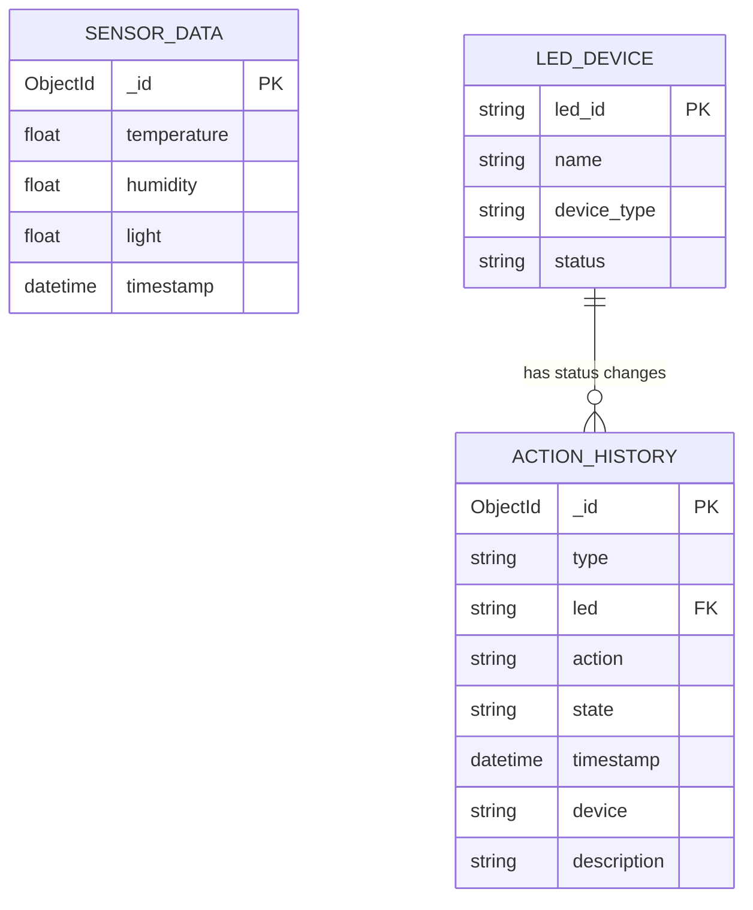

# IoT Monitoring System

<div align="center">

[](README.md)
[](README_vi.md)

</div>

A comprehensive IoT monitoring and control system using ESP32, featuring a modern web interface and powerful backend API with advanced NoSQL query capabilities.

## Table of Contents

-   [Overview](#overview)
-   [System Architecture](#system-architecture)
-   [Key Features](#key-features)
-   [Quick Start](#quick-start)
-   [Installation and Setup](#installation-and-setup)
-   [API Documentation](#api-documentation)
-   [Project Structure](#project-structure)
-   [MQTT Topics](#mqtt-topics)
-   [Development](#development)
-   [Troubleshooting](#troubleshooting)
-   [Contributing](#contributing)
-   [License](#license)
-   [Support](#support)

## Overview

This project implements a complete IoT monitoring system including:

-   **Hardware**: ESP32 device with DHT11 temperature/humidity sensor, light sensor, and 3 LED controls
-   **Backend**: REST API built with Flask, MongoDB, and MQTT integration
-   **Frontend**: Responsive web interface with real-time charts, data tables, and LED controls
-   **Communication**: MQTT protocol for real-time communication between ESP32 and backend
-   **Advanced Features**: NoSQL queries, data aggregation, time-based filtering, and comprehensive search

## System Architecture

```text
┌─────────────────┐            ┌─────────────────┐            ┌─────────────────┐
│  ESP32 Device   │            │   Backend API   │            │    Frontend     │
│                 │            │     (Flask)     │            │    (HTML/JS)    │
│                 │    MQTT    │                 │    HTTP    │                 │
│ - DHT11 Sensor  │ ─────────► │ - MQTT Client   │ ◄───────── │ - Real-time UI  │
│ - Light Sensor  │            │ - REST API      │            │ - Charts        │
│ - 3x LED Control│            │ - MongoDB       │            │ - Data Tables   │
│ - WiFi + MQTT   │            │ - NoSQL Queries │            │ - LED Controls  │
└─────────────────┘            └─────────────────┘            └─────────────────┘
```

## Data Model (ERD)

The import-ready Mermaid diagram is available in [`erd.mmd`](erd.mmd). The persisted MongoDB collections are `sensor_data` and `action_history`. `LED_DEVICE` is an application-level reference entity; `action_history.led` is a logical reference to `LED_DEVICE.led_id`, not a MongoDB-enforced foreign key.



## Key Features

### Hardware (ESP32)

-   **DHT11 Sensor**: Temperature and humidity readings
-   **Light Sensor**: Analog light sensor via ADC (Pin 34)
-   **LED Control**: 3 LEDs (Pins 25, 26, 27) with remote control
-   **WiFi Connectivity**: Automatic connection and reconnection
-   **MQTT Communication**: Secure TLS connection to HiveMQ Cloud
-   **Real-time Data**: Sends sensor data every 1 second
-   **Action History**: Publishes LED status changes

### Backend API

-   **RESTful API** with versioning (`/api/v1/`) and Swagger documentation
-   **MQTT Integration**: Receives sensor data and publishes LED commands
-   **MongoDB Database**: Stores sensor data and action history
-   **Advanced NoSQL Queries**: Text search, range queries, aggregation
-   **Real-time LED Control**: MQTT-based remote LED control
-   **Data Validation**: Comprehensive input validation and error handling
-   **Pagination & Filtering**: Advanced data filtering with time-based queries
-   **Timezone Support**: Vietnam timezone handling for all timestamps
-   **Health Monitoring**: System status and connection monitoring

### Frontend

-   **Home Page**: Real-time sensor cards, LED controls, and interactive charts
-   **Sensor Data Page**: Advanced data table with search, filtering, and pagination
-   **Action History Page**: LED control history with comprehensive filtering
-   **Profile Page**: User interface for system settings
-   **Responsive Design**: Mobile-friendly interface with sidebar navigation
-   **Real-time Updates**: Live data updates without page refresh
-   **Interactive Charts**: Chart.js integration with time-based data visualization

## Quick Start

1. **Clone the repository**
2. **Set up the backend** (see [Backend Setup](#backend-setup))
3. **Configure the hardware** (see [Hardware Setup](#hardware-setup))
4. **Access the web interface** at `http://localhost:5000`

## Installation and Setup

### System Requirements

-   Python 3.8+
-   MongoDB (local or cloud)
-   MQTT Broker (HiveMQ Cloud recommended)
-   ESP32 development board
-   Arduino IDE with ESP32 board package

### Backend Setup

1. **Clone repository and install dependencies:**

```bash
cd backend
pip install -r requirements.txt
```

2. **Configure environment variables:**
   Create `.env` file in `backend/` directory:

```env
# Database Configuration
MONGODB_CONNECTION_STRING=mongodb://localhost:27017
MONGODB_DB_NAME=iot_database
MONGODB_COLLECTION_NAME=sensor_data

# MQTT Configuration (HiveMQ Cloud)
MQTT_BROKER_HOST=your-hivemq-broker-host
MQTT_BROKER_PORT=8883
MQTT_USERNAME=your-hivemq-username
MQTT_PASSWORD=your-hivemq-password
MQTT_DATA_TOPIC=esp32/iot/data
MQTT_CONTROL_TOPIC=esp32/iot/control
MQTT_ACTION_HISTORY_TOPIC=esp32/iot/action-history

# API Configuration
API_HOST=0.0.0.0
API_PORT=5000
SECRET_KEY=your-secret-key
DEBUG_MODE=True

# Sensor Thresholds (Optional)
TEMP_NORMAL_MIN=25.0
TEMP_NORMAL_MAX=35.0
HUMIDITY_NORMAL_MIN=40.0
HUMIDITY_NORMAL_MAX=60.0
LIGHT_NORMAL_MIN=40.0
LIGHT_NORMAL_MAX=60.0
```

3. **Run backend:**

```bash
python main.py
```

Backend will run at `http://localhost:5000`

**API Documentation**: Available at `http://localhost:5000/docs/`

### Frontend Setup

Frontend consists of static files served by Flask backend. No additional dependencies required.

The frontend is automatically served by the Flask backend at `http://localhost:5000/`

### Hardware Setup

1. **Install Arduino IDE and ESP32 board package**

2. **Hardware connections:**

```text
ESP32 Pin Connections:
- DHT11: Pin 21
- Light Sensor: Pin 34 (ADC)
- LED1: Pin 25
- LED2: Pin 26
- LED3: Pin 27
```

3. **Configure WiFi and MQTT:**
   Edit parameters in [`hardware/IoT_Device/IoT_Device.ino`](hardware/IoT_Device/IoT_Device.ino) file:

```cpp
// WiFi Configuration
const char *wifiSsid = "YOUR_WIFI_SSID";
const char *wifiPassword = "YOUR_WIFI_PASSWORD";

// MQTT Configuration (HiveMQ Cloud)
const char *mqttServer = "your-hivemq-broker-host";
const char *mqttUsername = "your-hivemq-username";
const char *mqttPassword = "your-hivemq-password";
```

4. **Upload code to ESP32**

## API Documentation

Complete API documentation is available at `http://localhost:5000/docs/` when the backend is running.

### Main Endpoints

#### Sensor Data Endpoints

-   **GET** `/api/v1/sensors/sensor-data` - Get latest sensor data with status information
-   **GET** `/api/v1/sensors/sensor-data-list` - Get paginated sensor data with advanced filtering, sorting, and search
-   **GET** `/api/v1/sensors/sensor-data/chart` - Get chart data with time-based filtering and date selection
-   **GET** `/api/v1/sensors/home-data` - Get combined home page data (latest sensor data + LED status)

#### LED Control Endpoints

-   **POST** `/api/v1/sensors/led-control` - Control LED (ON/OFF) via MQTT
-   **GET** `/api/v1/sensors/led-status` - Get current LED status and pending commands
-   **GET** `/api/v1/sensors/action-history` - Get LED action history with filtering and pagination

### Query Parameters

#### Sensor Data List (`/api/v1/sensors/sensor-data-list`)

-   `page`: Page number (default: 1, min: 1)
-   `per_page`: Records per page (default: 10, min: 1, max: 100)
-   `sort_field`: Sort field - `timestamp`, `temperature`, `humidity`, `light` (default: `timestamp`)
-   `sort_order`: Sort order - `asc`, `desc` (default: `desc`)
-   `limit`: Limit number of records (positive integer) or `"all"` for all records
-   `search`: Search term for filtering (supports text search and time-based search)
-   `search_criteria`: Search criteria - `all`, `temperature`, `humidity`, `light`, `time` (default: `all`)
-   `sample`: Sampling frequency - every nth record (default: 1, min: 1)

**Search Examples:**

-   Text search: `search=25.5&search_criteria=temperature` - Find records with temperature = 25.5
-   Time search: `search=10:30:00 15/01/2024&search_criteria=time` - Find records at specific time
-   Time patterns: `HH:MM:SS DD/MM/YYYY`, `HH:MM:SS`, `HH:MM`, `DD/MM/YYYY`, `HH:MM DD/MM/YYYY`

#### Chart Data (`/api/v1/sensors/sensor-data/chart`)

-   `limit`: Number of records (default: 50, positive integer) or `"all"` for all records
-   `date`: Specific date in `YYYY-MM-DD` format (returns all records for that day)
-   `timePeriod`: Time period filter (deprecated - use `date` instead)

**Modes:**

-   **Real-time mode** (no `date` parameter): Returns most recent records up to `limit`
-   **Historical mode** (`date` parameter): Returns all records for specified date (or limited by `limit`)

#### Action History (`/api/v1/sensors/action-history`)

-   `page`: Page number (default: 1, min: 1)
-   `per_page`: Records per page (default: 10, min: 1, max: 100)
-   `sort_field`: Sort field - `timestamp`, `led`, `state` (default: `timestamp`)
-   `sort_order`: Sort order - `asc`, `desc` (default: `desc`)
-   `search`: Search term for filtering
-   `device_filter`: Filter by device - `all`, `LED1`, `LED2`, `LED3` (default: `all`)
-   `state_filter`: Filter by state - `all`, `ON`, `OFF` (default: `all`)
-   `limit`: Limit number of records (will reduce `per_page` if lower)

### Request/Response Examples

#### GET `/api/v1/sensors/sensor-data`

Get the latest sensor reading with status information.

**Response:**

```json
{
    "_id": "507f1f77bcf86cd799439011",
    "temperature": 25.5,
    "humidity": 60.2,
    "light": 45.8,
    "timestamp": "2024-01-15T10:30:00+07:00",
    "sensor_statuses": {
        "temperature": "normal",
        "humidity": "normal",
        "light": "normal"
    },
    "overall_status": {
        "status": "normal",
        "color_class": "status-normal"
    }
}
```

#### GET `/api/v1/sensors/sensor-data-list`

Get paginated list of sensor data with advanced filtering.

**Request Examples:**

```
GET /api/v1/sensors/sensor-data-list?page=1&per_page=20
GET /api/v1/sensors/sensor-data-list?search=25.5&search_criteria=temperature
GET /api/v1/sensors/sensor-data-list?search=10:30:00&search_criteria=time
GET /api/v1/sensors/sensor-data-list?sort_field=temperature&sort_order=desc
GET /api/v1/sensors/sensor-data-list?sample=5&limit=100
```

**Response:**

```json
{
    "status": "success",
    "data": [
        {
            "_id": "507f1f77bcf86cd799439011",
            "temperature": 25.5,
            "humidity": 60.2,
            "light": 45.8,
            "timestamp": "2024-01-15T10:30:00+07:00"
        }
    ],
    "pagination": {
        "page": 1,
        "per_page": 10,
        "total_count": 150,
        "total_pages": 15,
        "has_prev": false,
        "has_next": true
    },
    "sort": {
        "field": "timestamp",
        "order": "desc"
    },
    "search": {
        "term": "",
        "criteria": "all"
    },
    "count": 10,
    "total_count": 150
}
```

#### GET `/api/v1/sensors/sensor-data/chart`

Get sensor data for charts with time-based filtering.

**Request Examples:**

```
GET /api/v1/sensors/sensor-data/chart?limit=50
GET /api/v1/sensors/sensor-data/chart?limit=all
GET /api/v1/sensors/sensor-data/chart?date=2024-01-15
GET /api/v1/sensors/sensor-data/chart?date=2024-01-15&limit=100
```

**Response:**

```json
[
    {
        "_id": "507f1f77bcf86cd799439011",
        "temperature": 25.5,
        "humidity": 60.2,
        "light": 45.8,
        "timestamp": "2024-01-15T10:30:00+07:00"
    },
    {
        "_id": "507f1f77bcf86cd799439012",
        "temperature": 26.0,
        "humidity": 58.5,
        "light": 50.2,
        "timestamp": "2024-01-15T10:31:00+07:00"
    }
]
```

#### GET `/api/v1/sensors/home-data`

Get combined data for home page (latest sensor data + LED status).

**Response:**

```json
{
    "status": "success",
    "data": {
        "temperature": 25.5,
        "humidity": 60.2,
        "light": 45.8,
        "timestamp": "2024-01-15T10:30:00+07:00",
        "sensor_statuses": {
            "temperature": "normal",
            "humidity": "normal",
            "light": "normal"
        },
        "overall_status": {
            "status": "normal",
            "color_class": "status-normal"
        },
        "led_status": {
            "LED1": "ON",
            "LED2": "OFF",
            "LED3": "ON"
        }
    }
}
```

#### POST `/api/v1/sensors/led-control`

Control LED state via MQTT.

**Request Body:**

```json
{
    "led_id": "LED1",
    "action": "ON"
}
```

**Validation:**

-   `led_id`: Must be `LED1`, `LED2`, or `LED3`
-   `action`: Must be `ON` or `OFF`

**Success Response:**

```json
{
    "status": "success",
    "message": "Command LED1_ON sent successfully"
}
```

**Error Response:**

```json
{
    "status": "error",
    "message": "Invalid led_id"
}
```

#### GET `/api/v1/sensors/led-status`

Get current LED status and pending commands.

**Response:**

```json
{
    "status": "success",
    "data": {
        "led_states": {
            "LED1": "ON",
            "LED2": "OFF",
            "LED3": "ON"
        },
        "pending_commands": {
            "LED1": false,
            "LED2": true,
            "LED3": false
        }
    }
}
```

#### GET `/api/v1/sensors/action-history`

Get LED action history with filtering and pagination.

**Request Examples:**

```
GET /api/v1/sensors/action-history?page=1&per_page=20
GET /api/v1/sensors/action-history?device_filter=LED1
GET /api/v1/sensors/action-history?state_filter=ON
GET /api/v1/sensors/action-history?search=LED1&device_filter=LED1&state_filter=ON
GET /api/v1/sensors/action-history?sort_field=timestamp&sort_order=asc
```

**Response:**

```json
{
    "status": "success",
    "data": [
        {
            "_id": "507f1f77bcf86cd799439013",
            "type": "led_control",
            "led": "LED1",
            "action": "LED1_ON",
            "state": "ON",
            "timestamp": "2024-01-15T10:30:00+07:00",
            "device": "LED1",
            "description": "Điều khiển LED1 ON"
        }
    ],
    "pagination": {
        "page": 1,
        "per_page": 10,
        "total_count": 50,
        "total_pages": 5,
        "has_prev": false,
        "has_next": true
    },
    "filters": {
        "search": "",
        "device": "all",
        "state": "all"
    },
    "sort": {
        "field": "timestamp",
        "order": "desc"
    },
    "count": 10,
    "total_count": 50
}
```

## Project Structure

```text
IoT_Project/
├── .gitignore
├── README.md
│
├── backend/
│   ├── .env
│   ├── .env.example
│   ├── main.py                                            # Entry point
│   ├── requirements.txt                                   # Python dependencies
│   ├── app/
│   │   ├── __init__.py
│   │   ├── api/                                           # API routes and blueprints
│   │   │   ├── routes.py
│   │   │   ├── swagger_config.py
│   │   │   ├── __init__.py
│   │   │   └── v1/
│   │   │       ├── sensors.py
│   │   │       ├── sensors_swagger.py
│   │   │       └── __init__.py
│   │   │
│   │   ├── core/                                          # Configuration and database
│   │   │   ├── config.py
│   │   │   ├── database.py
│   │   │   ├── logger_config.py
│   │   │   ├── timezone_utils.py
│   │   │   └── __init__.py
│   │   │
│   │   ├── models/                                        # Data models
│   │   │   ├── device.py
│   │   │   ├── sensor_data.py
│   │   │   └── __init__.py
│   │   │
│   │   └── services/                                      # Business logic
│   │       ├── data_service.py
│   │       ├── led_control_service.py
│   │       ├── mqtt_service.py
│   │       ├── status_service.py
│   │       ├── validation_service.py
│   │       └── __init__.py
│   │
│   └── tests/
│       └── __init__.py
│
├── frontend/
│   ├── public/                                            # HTML pages
│   │   ├── action-history.html
│   │   ├── home-page.html
│   │   ├── profile.html
│   │   └── sensor-data.html
│   │
│   └── src/
│       ├── components/                                    # UI components
│       │   └── update-indicator.js
│       │
│       ├── control/                                       # Controllers
│       │   ├── action-history-table-control.js
│       │   ├── home-page-chart-control.js
│       │   ├── home-page-led-control.js
│       │   ├── home-page-sensor-card-control.js
│       │   ├── profile-control.js
│       │   └── sensor-data-table-control.js
│       │
│       ├── pages/                                         # Page loaders
│       │   ├── action-history-loader.js
│       │   ├── home-page-loader.js
│       │   └── sensor-data-loader.js
│       │
│       ├── services/                                      # API services
│       │   └── api.js
│       │
│       ├── styles/                                        # CSS files
│       │   ├── main.css
│       │   ├── pages.css
│       │   └── profile.css
│       │
│       └── view/                                          # Views and templates
│           ├── charts/
│           │   ├── home-page-chart.js
│           │
│           ├── sensors/
│           │   └── home-page-sensor-card.js
│           │
│           └── table/
│               ├── action-history-table.js
│               └── sensor-data-table.js
│
└── hardware/
    └── IoT_Device/
        ├── IoT_Device.ino                                 # ESP32 code
        └── pubsub.txt                                     # MQTT test commands
```

## MQTT Topics

-   **`esp32/iot/data`**: Sensor data from ESP32 (temperature, humidity, light)
-   **`esp32/iot/control`**: LED control commands from backend to ESP32
-   **`esp32/iot/action-history`**: LED status changes and action history

### MQTT Message Formats

#### Sensor Data (`esp32/iot/data`)

```json
{
    "temperature": 25.5,
    "humidity": 60.2,
    "light": 45.8
}
```

#### LED Control (`esp32/iot/control`)

```text
LED1_ON
LED1_OFF
LED2_ON
LED2_OFF
LED3_ON
LED3_OFF
```

#### Action History (`esp32/iot/action-history`)

```json
{
    "type": "led_status",
    "led": "LED1",
    "state": "ON"
}
```

## Development

### Backend Development

Backend uses Flask with modular architecture:

-   **Blueprints** for API organization
-   **Services** for business logic
-   **Models** for data structures
-   **Core** for configuration and utilities

### Frontend Development

Frontend uses vanilla JavaScript with MVC architecture:

-   **Controllers** handle logic and API calls
-   **Views** display UI components
-   **Services** manage API communication
-   **Components** reusable UI elements

### Testing MQTT

Use mosquitto client to test MQTT (example commands in [`hardware/IoT_Device/pubsub.txt`](hardware/IoT_Device/pubsub.txt)):

```bash
# Subscribe to sensor data
mosquitto_sub -h your-hivemq-broker -p 8883 -u username -P password -t "esp32/iot/data"

# Subscribe to action history
mosquitto_sub -h your-hivemq-broker -p 8883 -u username -P password -t "esp32/iot/action-history"

# Send LED control command
mosquitto_pub -h your-hivemq-broker -p 8883 -u username -P password -t "esp32/iot/control" -m "LED1_ON"

# Send test sensor data
mosquitto_pub -h your-hivemq-broker -p 8883 -u username -P password -t "esp32/iot/data" -m '{"temperature":25.0,"humidity":60.0,"light":80.0}'
```

## Troubleshooting

### Common Issues

#### Hardware Issues

1. **ESP32 cannot connect to WiFi:**

    - Check SSID and password in [`hardware/IoT_Device/IoT_Device.ino`](hardware/IoT_Device/IoT_Device.ino)
    - Ensure WiFi is in 2.4GHz mode
    - Verify signal strength

2. **LED control not working:**
    - Check MQTT broker connection
    - Verify LED control topic subscription
    - Check ESP32 MQTT client status

#### Backend Issues

3. **MQTT connection failed:**

    - Check broker host and port in `.env` file
    - Verify username/password
    - Test with mosquitto client (see [Testing MQTT](#testing-mqtt))

4. **Backend not receiving data:**

    - Check MQTT broker connection
    - Verify topic names match configuration
    - Check MongoDB connection

5. **NoSQL queries not working:**
    - Verify MongoDB connection
    - Check collection names and indexes
    - Review query syntax and parameters

#### Frontend Issues

6. **Frontend not displaying data:**
    - Check browser console for errors
    - Verify API endpoints are accessible at `http://localhost:5000`
    - Check CORS configuration
    - Ensure backend is running on correct port

## Contributing

We welcome contributions! Here's how you can help:

1. **Fork the repository**
2. **Create a feature branch** (`git checkout -b feature/amazing-feature`)
3. **Commit your changes** (`git commit -m 'Add some amazing feature'`)
4. **Push to the branch** (`git push origin feature/amazing-feature`)
5. **Open a Pull Request**

### Development Guidelines

-   Follow the existing code structure and patterns
-   Add appropriate comments and documentation
-   Test your changes thoroughly
-   Ensure all existing tests pass

## License

This project is developed for educational and research purposes.

## Support

For support, questions, or contributions, please:

-   Create an issue on the GitHub repository
-   Check the [Troubleshooting](#troubleshooting) section first
-   Review the [API Documentation](http://localhost:5000/docs/) when the backend is running
