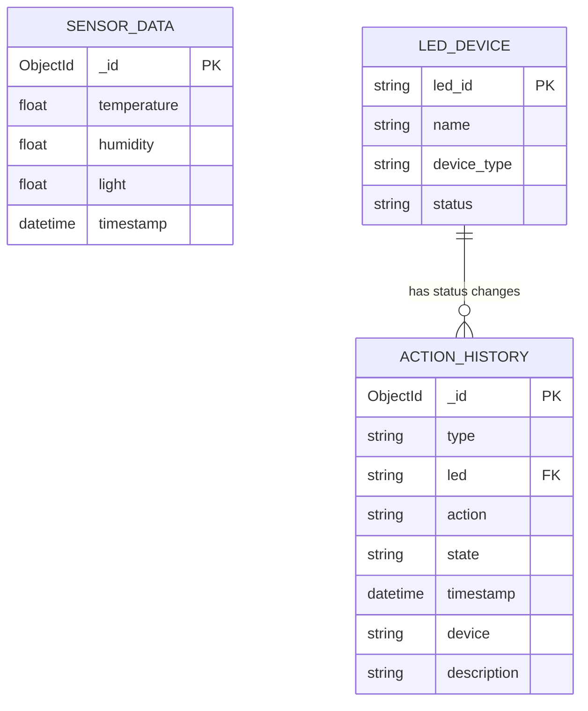

# Hệ Thống Giám Sát IoT

<div align="center">

[](README.md)
[](README_vi.md)

</div>

Hệ thống giám sát và điều khiển IoT toàn diện sử dụng ESP32, với giao diện web hiện đại và API backend mạnh mẽ cùng khả năng truy vấn NoSQL tiên tiến.

## Mục Lục

-   [Tổng Quan](#tổng-quan)
-   [Kiến Trúc Hệ Thống](#kiến-trúc-hệ-thống)
-   [Mô Hình Dữ Liệu (ERD)](#mô-hình-dữ-liệu-erd)
-   [Tính Năng Chính](#tính-năng-chính)
-   [Bắt Đầu Nhanh](#bắt-đầu-nhanh)
-   [Cài Đặt và Thiết Lập](#cài-đặt-và-thiết-lập)
-   [Tài Liệu API](#tài-liệu-api)
-   [Cấu Trúc Dự Án](#cấu-trúc-dự-án)
-   [Chủ Đề MQTT](#chủ-đề-mqtt)
-   [Phát Triển](#phát-triển)
-   [Khắc Phục Sự Cố](#khắc-phục-sự-cố)
-   [Đóng Góp](#đóng-góp)
-   [Giấy Phép](#giấy-phép)
-   [Hỗ Trợ](#hỗ-trợ)

## Tổng Quan

Dự án này triển khai một hệ thống giám sát IoT hoàn chỉnh bao gồm:

-   **Phần Cứng**: Thiết bị ESP32 với cảm biến nhiệt độ/độ ẩm DHT11, cảm biến ánh sáng và 3 điều khiển LED
-   **Backend**: REST API được xây dựng với Flask, MongoDB và tích hợp MQTT
-   **Frontend**: Giao diện web đáp ứng với biểu đồ thời gian thực, bảng dữ liệu và điều khiển LED
-   **Giao Tiếp**: Giao thức MQTT cho giao tiếp thời gian thực giữa ESP32 và backend
-   **Tính Năng Nâng Cao**: Truy vấn NoSQL, tổng hợp dữ liệu, lọc theo thời gian và tìm kiếm toàn diện

## Kiến Trúc Hệ Thống

```text
┌─────────────────────┐            ┌──────────────────┐            ┌────────────────────────────┐
│   Thiết Bị ESP32    │            │   Backend API    │            │          Frontend          │
│                     │            │     (Flask)      │            │          (HTML/JS)         │
│                     │            │                  │            │                            │
│ - Cảm Biến DHT11    │    MQTT    │ - MQTT Client    │    HTTP    │ - Giao Diện Thời Gian Thực │
│ - Cảm Biến Ánh Sáng │ ─────────► │ - REST API       │ ◄───────── │ - Biểu Đồ                  │
│ - 3x Điều Khiển LED │            │ - MongoDB        │            │ - Bảng Dữ Liệu             │
│ - WiFi + MQTT       │            │ - Truy Vấn NoSQL │            │ - Điều Khiển LED           │
└─────────────────────┘            └──────────────────┘            └────────────────────────────┘
```

## Mô Hình Dữ Liệu (ERD)

Sơ đồ ERD có thể import trực tiếp tại [`erd.mmd`](erd.mmd). Dự án sử dụng MongoDB: `sensor_data` và `action_history` là hai collection được lưu trữ; `LED_DEVICE` mô tả thiết bị LED ở tầng ứng dụng. Trường `led` trong `action_history` là tham chiếu logic tới `LED_DEVICE.led_id`, không phải khóa ngoại do MongoDB bắt buộc.



## Tính Năng Chính

### Phần Cứng (ESP32)

-   **Cảm Biến DHT11**: Đọc nhiệt độ và độ ẩm
-   **Cảm Biến Ánh Sáng**: Cảm biến ánh sáng tương tự qua ADC (Pin 34)
-   **Điều Khiển LED**: 3 LED (Pin 25, 26, 27) với điều khiển từ xa
-   **Kết Nối WiFi**: Kết nối và kết nối lại tự động
-   **Giao Tiếp MQTT**: Kết nối TLS bảo mật tới HiveMQ Cloud
-   **Dữ Liệu Thời Gian Thực**: Gửi dữ liệu cảm biến mỗi 1 giây
-   **Lịch Sử Hành Động**: Xuất bản thay đổi trạng thái LED

### Backend API

-   **RESTful API** với phiên bản (`/api/v1/`) và tài liệu Swagger
-   **Tích Hợp MQTT**: Nhận dữ liệu cảm biến và xuất bản lệnh LED
-   **Cơ Sở Dữ Liệu MongoDB**: Lưu trữ dữ liệu cảm biến và lịch sử hành động
-   **Truy Vấn NoSQL Nâng Cao**: Tìm kiếm văn bản, truy vấn phạm vi, tổng hợp
-   **Điều Khiển LED Thời Gian Thực**: Điều khiển LED từ xa dựa trên MQTT
-   **Xác Thực Dữ Liệu**: Xác thực đầu vào toàn diện và xử lý lỗi
-   **Phân Trang & Lọc**: Lọc dữ liệu nâng cao với truy vấn theo thời gian
-   **Hỗ Trợ Múi Giờ**: Xử lý múi giờ Việt Nam cho tất cả dấu thời gian
-   **Giám Sát Sức Khỏe**: Trạng thái hệ thống và giám sát kết nối

### Frontend

-   **Trang Chủ**: Thẻ cảm biến thời gian thực, điều khiển LED và biểu đồ tương tác
-   **Trang Dữ Liệu Cảm Biến**: Bảng dữ liệu nâng cao với tìm kiếm, lọc và phân trang
-   **Trang Lịch Sử Hành Động**: Lịch sử điều khiển LED với lọc toàn diện
-   **Trang Hồ Sơ**: Giao diện người dùng cho cài đặt hệ thống
-   **Thiết Kế Đáp Ứng**: Giao diện thân thiện với thiết bị di động với điều hướng thanh bên
-   **Cập Nhật Thời Gian Thực**: Cập nhật dữ liệu trực tiếp không cần làm mới trang
-   **Biểu Đồ Tương Tác**: Tích hợp Chart.js với trực quan hóa dữ liệu theo thời gian

## Bắt Đầu Nhanh

1. **Clone repository**
2. **Thiết lập backend** (xem [Thiết Lập Backend](#thiết-lập-backend))
3. **Cấu hình phần cứng** (xem [Thiết Lập Phần Cứng](#thiết-lập-phần-cứng))
4. **Truy cập giao diện web** tại `http://localhost:5000`

## Cài Đặt và Thiết Lập

### Yêu Cầu Hệ Thống

-   Python 3.8+
-   MongoDB (cục bộ hoặc đám mây)
-   MQTT Broker (khuyến nghị HiveMQ Cloud)
-   Bảng phát triển ESP32
-   Arduino IDE với gói bảng ESP32

### Thiết Lập Backend

1. **Clone repository và cài đặt dependencies:**

```bash
cd backend
pip install -r requirements.txt
```

2. **Cấu hình biến môi trường:**
   Tạo file `.env` trong thư mục `backend/`:

```env
# Cấu Hình Cơ Sở Dữ Liệu
MONGODB_CONNECTION_STRING=mongodb://localhost:27017
MONGODB_DB_NAME=iot_database
MONGODB_COLLECTION_NAME=sensor_data

# Cấu Hình MQTT (HiveMQ Cloud)
MQTT_BROKER_HOST=your-hivemq-broker-host
MQTT_BROKER_PORT=8883
MQTT_USERNAME=your-hivemq-username
MQTT_PASSWORD=your-hivemq-password
MQTT_DATA_TOPIC=esp32/iot/data
MQTT_CONTROL_TOPIC=esp32/iot/control
MQTT_ACTION_HISTORY_TOPIC=esp32/iot/action-history

# Cấu Hình API
API_HOST=0.0.0.0
API_PORT=5000
SECRET_KEY=your-secret-key
DEBUG_MODE=True

# Ngưỡng Cảm Biến (Tùy Chọn)
TEMP_NORMAL_MIN=25.0
TEMP_NORMAL_MAX=35.0
HUMIDITY_NORMAL_MIN=40.0
HUMIDITY_NORMAL_MAX=60.0
LIGHT_NORMAL_MIN=40.0
LIGHT_NORMAL_MAX=60.0
```

3. **Chạy backend:**

```bash
python main.py
```

Backend sẽ chạy tại `http://localhost:5000`

**Tài Liệu API**: Có sẵn tại `http://localhost:5000/docs/`

### Thiết Lập Frontend

Frontend bao gồm các file tĩnh được phục vụ bởi Flask backend. Không cần dependencies bổ sung.

Frontend được tự động phục vụ bởi Flask backend tại `http://localhost:5000/`

### Thiết Lập Phần Cứng

#### Bật/tắt LED trực tiếp bằng Arduino IDE

Sau khi nạp sketch, mở **Serial Monitor**, chọn **115200 baud** và line ending
**Newline**. Có thể gửi các lệnh dưới đây để ESP32 điều khiển LED trực tiếp,
không cần thao tác trên giao diện web:

```text
LED1_ON    LED1_OFF
LED2_ON    LED2_OFF
LED3_ON    LED3_OFF
ALL_ON     ALL_OFF
```

LED cần được nối lần lượt với GPIO 23, 22 và 18 như trong sketch.

1. **Cài đặt Arduino IDE và gói bảng ESP32**

2. **Kết nối phần cứng:**

```text
Kết Nối Pin ESP32:
- DHT11: Pin 21
- Cảm Biến Ánh Sáng: Pin 34 (ADC)
- LED1: Pin 25
- LED2: Pin 26
- LED3: Pin 27
```

3. **Cấu hình WiFi và MQTT:**
   Chỉnh sửa tham số trong file [`hardware/IoT_Device/IoT_Device.ino`](hardware/IoT_Device/IoT_Device.ino):

```cpp
// Cấu Hình WiFi
const char *wifiSsid = "TEN_WIFI_CUA_BAN";
const char *wifiPassword = "MAT_KHAU_WIFI_CUA_BAN";

// Cấu Hình MQTT (HiveMQ Cloud)
const char *mqttServer = "your-hivemq-broker-host";
const char *mqttUsername = "your-hivemq-username";
const char *mqttPassword = "your-hivemq-password";
```

4. **Tải code lên ESP32**

## Tài Liệu API

Tài liệu API đầy đủ có sẵn tại `http://localhost:5000/docs/` khi backend đang chạy.

### Endpoint Chính

#### Endpoint Dữ Liệu Cảm Biến

-   **GET** `/api/v1/sensors/sensor-data` - Lấy dữ liệu cảm biến mới nhất với thông tin trạng thái
-   **GET** `/api/v1/sensors/sensor-data-list` - Lấy danh sách dữ liệu cảm biến với phân trang, sắp xếp và tìm kiếm nâng cao
-   **GET** `/api/v1/sensors/sensor-data/chart` - Lấy dữ liệu biểu đồ với lọc theo thời gian và chọn ngày
-   **GET** `/api/v1/sensors/home-data` - Lấy dữ liệu kết hợp cho trang chủ (dữ liệu cảm biến mới nhất + trạng thái LED)

#### Endpoint Điều Khiển LED

-   **POST** `/api/v1/sensors/led-control` - Điều khiển LED (BẬT/TẮT) qua MQTT
-   **GET** `/api/v1/sensors/led-status` - Lấy trạng thái LED hiện tại và lệnh đang chờ xử lý
-   **GET** `/api/v1/sensors/action-history` - Lấy lịch sử hành động LED với lọc và phân trang

### Tham Số Truy Vấn

#### Danh Sách Dữ Liệu Cảm Biến (`/api/v1/sensors/sensor-data-list`)

-   `page`: Số trang (mặc định: 1, tối thiểu: 1)
-   `per_page`: Bản ghi mỗi trang (mặc định: 10, tối thiểu: 1, tối đa: 100)
-   `sort_field`: Trường sắp xếp - `timestamp`, `temperature`, `humidity`, `light` (mặc định: `timestamp`)
-   `sort_order`: Thứ tự sắp xếp - `asc`, `desc` (mặc định: `desc`)
-   `limit`: Giới hạn số bản ghi (số nguyên dương) hoặc `"all"` để lấy tất cả
-   `search`: Thuật ngữ tìm kiếm để lọc (hỗ trợ tìm kiếm văn bản và theo thời gian)
-   `search_criteria`: Tiêu chí tìm kiếm - `all`, `temperature`, `humidity`, `light`, `time` (mặc định: `all`)
-   `sample`: Tần suất lấy mẫu - lấy mỗi bản ghi thứ n (mặc định: 1, tối thiểu: 1)

**Ví Dụ Tìm Kiếm:**

-   Tìm kiếm văn bản: `search=25.5&search_criteria=temperature` - Tìm bản ghi có nhiệt độ = 25.5
-   Tìm kiếm thời gian: `search=10:30:00 15/01/2024&search_criteria=time` - Tìm bản ghi tại thời điểm cụ thể
-   Định dạng thời gian: `HH:MM:SS DD/MM/YYYY`, `HH:MM:SS`, `HH:MM`, `DD/MM/YYYY`, `HH:MM DD/MM/YYYY`

#### Dữ Liệu Biểu Đồ (`/api/v1/sensors/sensor-data/chart`)

-   `limit`: Số lượng bản ghi (mặc định: 50, số nguyên dương) hoặc `"all"` để lấy tất cả
-   `date`: Ngày cụ thể theo định dạng `YYYY-MM-DD` (trả về tất cả bản ghi trong ngày đó)
-   `timePeriod`: Bộ lọc khoảng thời gian (không khuyến khích - sử dụng `date` thay thế)

**Chế Độ:**

-   **Chế độ thời gian thực** (không có tham số `date`): Trả về các bản ghi mới nhất cho đến giới hạn `limit`
-   **Chế độ lịch sử** (có tham số `date`): Trả về tất cả bản ghi cho ngày được chỉ định (hoặc giới hạn bởi `limit`)

#### Lịch Sử Hành Động (`/api/v1/sensors/action-history`)

-   `page`: Số trang (mặc định: 1, tối thiểu: 1)
-   `per_page`: Bản ghi mỗi trang (mặc định: 10, tối thiểu: 1, tối đa: 100)
-   `sort_field`: Trường sắp xếp - `timestamp`, `led`, `state` (mặc định: `timestamp`)
-   `sort_order`: Thứ tự sắp xếp - `asc`, `desc` (mặc định: `desc`)
-   `search`: Thuật ngữ tìm kiếm để lọc
-   `device_filter`: Lọc theo thiết bị - `all`, `LED1`, `LED2`, `LED3` (mặc định: `all`)
-   `state_filter`: Lọc theo trạng thái - `all`, `ON`, `OFF` (mặc định: `all`)
-   `limit`: Giới hạn số bản ghi (sẽ giảm `per_page` nếu nhỏ hơn)

### Ví Dụ Request/Response

#### GET `/api/v1/sensors/sensor-data`

Lấy dữ liệu cảm biến mới nhất với thông tin trạng thái.

**Response:**

```json
{
    "_id": "507f1f77bcf86cd799439011",
    "temperature": 25.5,
    "humidity": 60.2,
    "light": 45.8,
    "timestamp": "2024-01-15T10:30:00+07:00",
    "sensor_statuses": {
        "temperature": "normal",
        "humidity": "normal",
        "light": "normal"
    },
    "overall_status": {
        "status": "normal",
        "color_class": "status-normal"
    }
}
```

#### GET `/api/v1/sensors/sensor-data-list`

Lấy danh sách dữ liệu cảm biến phân trang với lọc nâng cao.

**Ví Dụ Request:**

```
GET /api/v1/sensors/sensor-data-list?page=1&per_page=20
GET /api/v1/sensors/sensor-data-list?search=25.5&search_criteria=temperature
GET /api/v1/sensors/sensor-data-list?search=10:30:00&search_criteria=time
GET /api/v1/sensors/sensor-data-list?sort_field=temperature&sort_order=desc
GET /api/v1/sensors/sensor-data-list?sample=5&limit=100
```

**Response:**

```json
{
    "status": "success",
    "data": [
        {
            "_id": "507f1f77bcf86cd799439011",
            "temperature": 25.5,
            "humidity": 60.2,
            "light": 45.8,
            "timestamp": "2024-01-15T10:30:00+07:00"
        }
    ],
    "pagination": {
        "page": 1,
        "per_page": 10,
        "total_count": 150,
        "total_pages": 15,
        "has_prev": false,
        "has_next": true
    },
    "sort": {
        "field": "timestamp",
        "order": "desc"
    },
    "search": {
        "term": "",
        "criteria": "all"
    },
    "count": 10,
    "total_count": 150
}
```

#### GET `/api/v1/sensors/sensor-data/chart`

Lấy dữ liệu cảm biến cho biểu đồ với lọc theo thời gian.

**Ví Dụ Request:**

```
GET /api/v1/sensors/sensor-data/chart?limit=50
GET /api/v1/sensors/sensor-data/chart?limit=all
GET /api/v1/sensors/sensor-data/chart?date=2024-01-15
GET /api/v1/sensors/sensor-data/chart?date=2024-01-15&limit=100
```

**Response:**

```json
[
    {
        "_id": "507f1f77bcf86cd799439011",
        "temperature": 25.5,
        "humidity": 60.2,
        "light": 45.8,
        "timestamp": "2024-01-15T10:30:00+07:00"
    },
    {
        "_id": "507f1f77bcf86cd799439012",
        "temperature": 26.0,
        "humidity": 58.5,
        "light": 50.2,
        "timestamp": "2024-01-15T10:31:00+07:00"
    }
]
```

#### GET `/api/v1/sensors/home-data`

Lấy dữ liệu kết hợp cho trang chủ (dữ liệu cảm biến mới nhất + trạng thái LED).

**Response:**

```json
{
    "status": "success",
    "data": {
        "temperature": 25.5,
        "humidity": 60.2,
        "light": 45.8,
        "timestamp": "2024-01-15T10:30:00+07:00",
        "sensor_statuses": {
            "temperature": "normal",
            "humidity": "normal",
            "light": "normal"
        },
        "overall_status": {
            "status": "normal",
            "color_class": "status-normal"
        },
        "led_status": {
            "LED1": "ON",
            "LED2": "OFF",
            "LED3": "ON"
        }
    }
}
```

#### POST `/api/v1/sensors/led-control`

Điều khiển trạng thái LED qua MQTT.

**Nội Dung Yêu Cầu:**

```json
{
    "led_id": "LED1",
    "action": "ON"
}
```

**Xác Thực:**

-   `led_id`: Phải là `LED1`, `LED2`, hoặc `LED3`
-   `action`: Phải là `ON` hoặc `OFF`

**Response Thành Công:**

```json
{
    "status": "success",
    "message": "Command LED1_ON sent successfully"
}
```

**Response Lỗi:**

```json
{
    "status": "error",
    "message": "Invalid led_id"
}
```

#### GET `/api/v1/sensors/led-status`

Lấy trạng thái LED hiện tại và lệnh đang chờ xử lý.

**Response:**

```json
{
    "status": "success",
    "data": {
        "led_states": {
            "LED1": "ON",
            "LED2": "OFF",
            "LED3": "ON"
        },
        "pending_commands": {
            "LED1": false,
            "LED2": true,
            "LED3": false
        }
    }
}
```

#### GET `/api/v1/sensors/action-history`

Lấy lịch sử hành động LED với lọc và phân trang.

**Ví Dụ Request:**

```
GET /api/v1/sensors/action-history?page=1&per_page=20
GET /api/v1/sensors/action-history?device_filter=LED1
GET /api/v1/sensors/action-history?state_filter=ON
GET /api/v1/sensors/action-history?search=LED1&device_filter=LED1&state_filter=ON
GET /api/v1/sensors/action-history?sort_field=timestamp&sort_order=asc
```

**Response:**

```json
{
    "status": "success",
    "data": [
        {
            "_id": "507f1f77bcf86cd799439013",
            "type": "led_control",
            "led": "LED1",
            "action": "LED1_ON",
            "state": "ON",
            "timestamp": "2024-01-15T10:30:00+07:00",
            "device": "LED1",
            "description": "Điều khiển LED1 ON"
        }
    ],
    "pagination": {
        "page": 1,
        "per_page": 10,
        "total_count": 50,
        "total_pages": 5,
        "has_prev": false,
        "has_next": true
    },
    "filters": {
        "search": "",
        "device": "all",
        "state": "all"
    },
    "sort": {
        "field": "timestamp",
        "order": "desc"
    },
    "count": 10,
    "total_count": 50
}
```

## Cấu Trúc Dự Án

```text
IoT_Project/
├── .gitignore
├── README.md
├── README_vi.md
│
├── backend/
│   ├── .env
│   ├── .env.example
│   ├── main.py                                            # Entry point
│   ├── requirements.txt                                   # Dependencies Python
│   ├── app/
│   │   ├── __init__.py
│   │   ├── api/                                           # Route API và blueprint
│   │   │   ├── routes.py
│   │   │   ├── swagger_config.py
│   │   │   ├── __init__.py
│   │   │   └── v1/
│   │   │       ├── sensors.py
│   │   │       ├── sensors_swagger.py
│   │   │       └── __init__.py
│   │   │
│   │   ├── core/                                          # Cấu hình và cơ sở dữ liệu
│   │   │   ├── config.py
│   │   │   ├── database.py
│   │   │   ├── logger_config.py
│   │   │   ├── timezone_utils.py
│   │   │   └── __init__.py
│   │   │
│   │   ├── models/                                        # Mô hình dữ liệu
│   │   │   ├── device.py
│   │   │   ├── sensor_data.py
│   │   │   └── __init__.py
│   │   │
│   │   └── services/                                      # Logic nghiệp vụ
│   │       ├── data_service.py
│   │       ├── led_control_service.py
│   │       ├── mqtt_service.py
│   │       ├── status_service.py
│   │       ├── validation_service.py
│   │       └── __init__.py
│   │
│   └── tests/
│       └── __init__.py
│
├── frontend/
│   ├── public/                                            # Trang HTML
│   │   ├── action-history.html
│   │   ├── home-page.html
│   │   ├── profile.html
│   │   └── sensor-data.html
│   │
│   └── src/
│       ├── components/                                    # Thành phần UI
│       │   └── update-indicator.js
│       │
│       ├── control/                                       # Bộ điều khiển
│       │   ├── action-history-table-control.js
│       │   ├── home-page-chart-control.js
│       │   ├── home-page-led-control.js
│       │   ├── home-page-sensor-card-control.js
│       │   ├── profile-control.js
│       │   └── sensor-data-table-control.js
│       │
│       ├── pages/                                         # Trình tải trang
│       │   ├── action-history-loader.js
│       │   ├── home-page-loader.js
│       │   └── sensor-data-loader.js
│       │
│       ├── services/                                      # Dịch vụ API
│       │   └── api.js
│       │
│       ├── styles/                                        # File CSS
│       │   ├── main.css
│       │   ├── pages.css
│       │   └── profile.css
│       │
│       └── view/                                          # View và template
│           ├── charts/
│           │   ├── home-page-chart.js
│           │
│           ├── sensors/
│           │   └── home-page-sensor-card.js
│           │
│           └── table/
│               ├── action-history-table.js
│               └── sensor-data-table.js
│
└── hardware/
    └── IoT_Device/
        ├── IoT_Device.ino                                 # Code ESP32
        └── pubsub.txt                                     # Lệnh test MQTT
```

## Chủ Đề MQTT

-   **`esp32/iot/data`**: Dữ liệu cảm biến từ ESP32 (nhiệt độ, độ ẩm, ánh sáng)
-   **`esp32/iot/control`**: Lệnh điều khiển LED từ backend tới ESP32
-   **`esp32/iot/action-history`**: Thay đổi trạng thái LED và lịch sử hành động

### Định Dạng Tin Nhắn MQTT

#### Dữ Liệu Cảm Biến (`esp32/iot/data`)

```json
{
    "temperature": 25.5,
    "humidity": 60.2,
    "light": 45.8
}
```

#### Điều Khiển LED (`esp32/iot/control`)

```text
LED1_ON
LED1_OFF
LED2_ON
LED2_OFF
LED3_ON
LED3_OFF
```

#### Lịch Sử Hành Động (`esp32/iot/action-history`)

```json
{
    "type": "led_status",
    "led": "LED1",
    "state": "ON"
}
```

## Phát Triển

### Phát Triển Backend

Backend sử dụng Flask với kiến trúc mô-đun:

-   **Blueprint** để tổ chức API
-   **Services** cho logic nghiệp vụ
-   **Models** cho cấu trúc dữ liệu
-   **Core** cho cấu hình và tiện ích

### Phát Triển Frontend

Frontend sử dụng JavaScript thuần với kiến trúc MVC:

-   **Controllers** xử lý logic và gọi API
-   **Views** hiển thị thành phần UI
-   **Services** quản lý giao tiếp API
-   **Components** thành phần UI có thể tái sử dụng

### Test MQTT

Sử dụng mosquitto client để test MQTT (lệnh mẫu trong [`hardware/IoT_Device/pubsub.txt`](hardware/IoT_Device/pubsub.txt)):

```bash
# Subscribe dữ liệu cảm biến
mosquitto_sub -h your-hivemq-broker -p 8883 -u username -P password -t "esp32/iot/data"

# Subscribe lịch sử hành động
mosquitto_sub -h your-hivemq-broker -p 8883 -u username -P password -t "esp32/iot/action-history"

# Gửi lệnh điều khiển LED
mosquitto_pub -h your-hivemq-broker -p 8883 -u username -P password -t "esp32/iot/control" -m "LED1_ON"

# Gửi dữ liệu cảm biến test
mosquitto_pub -h your-hivemq-broker -p 8883 -u username -P password -t "esp32/iot/data" -m '{"temperature":25.0,"humidity":60.0,"light":80.0}'
```

## Khắc Phục Sự Cố

### Vấn Đề Thường Gặp

#### Vấn Đề Phần Cứng

1. **ESP32 không thể kết nối WiFi:**

    - Kiểm tra SSID và mật khẩu trong [`hardware/IoT_Device/IoT_Device.ino`](hardware/IoT_Device/IoT_Device.ino)
    - Đảm bảo WiFi ở chế độ 2.4GHz
    - Xác minh cường độ tín hiệu

2. **Điều khiển LED không hoạt động:**
    - Kiểm tra kết nối MQTT broker
    - Xác minh đăng ký chủ đề điều khiển LED
    - Kiểm tra trạng thái MQTT client ESP32

#### Vấn Đề Backend

3. **Kết nối MQTT thất bại:**

    - Kiểm tra host và port broker trong file `.env`
    - Xác minh username/password
    - Test với mosquitto client (xem [Test MQTT](#test-mqtt))

4. **Backend không nhận được dữ liệu:**

    - Kiểm tra kết nối MQTT broker
    - Xác minh tên chủ đề khớp với cấu hình
    - Kiểm tra kết nối MongoDB

5. **Truy vấn NoSQL không hoạt động:**
    - Xác minh kết nối MongoDB
    - Kiểm tra tên collection và index
    - Xem lại cú pháp truy vấn và tham số

#### Vấn Đề Frontend

6. **Frontend không hiển thị dữ liệu:**
    - Kiểm tra console trình duyệt để tìm lỗi
    - Xác minh endpoint API có thể truy cập tại `http://localhost:5000`
    - Kiểm tra cấu hình CORS
    - Đảm bảo backend đang chạy trên port đúng

## Đóng Góp

Chúng tôi hoan nghênh sự đóng góp! Đây là cách bạn có thể giúp:

1. **Fork repository**
2. **Tạo nhánh tính năng** (`git checkout -b feature/tinh-nang-tuyet-voi`)
3. **Commit thay đổi** (`git commit -m 'Thêm tính năng tuyệt vời'`)
4. **Push lên nhánh** (`git push origin feature/tinh-nang-tuyet-voi`)
5. **Mở Pull Request**

### Hướng Dẫn Phát Triển

-   Tuân theo cấu trúc và mẫu code hiện có
-   Thêm comment và tài liệu phù hợp
-   Test thay đổi một cách kỹ lưỡng
-   Đảm bảo tất cả test hiện có đều pass

## Giấy Phép

Dự án này được phát triển cho mục đích giáo dục và nghiên cứu.

## Hỗ Trợ

Để được hỗ trợ, câu hỏi hoặc đóng góp, vui lòng:

-   Tạo issue trên GitHub repository
-   Kiểm tra phần [Khắc Phục Sự Cố](#khắc-phục-sự-cố) trước
-   Xem lại [Tài Liệu API](http://localhost:5000/docs/) khi backend đang chạy
